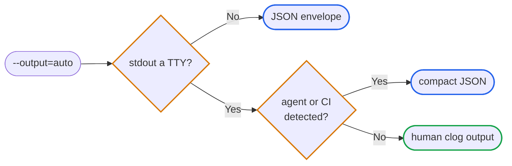

# Output

`jira` has one global output selector, `--output` (short `-o`), with four
values:

```sh
jira issue list --output=auto
jira issue list --output=human
jira issue list -o json
jira issue list -o compact
```

## Modes

| Mode | Behavior |
|------|----------|
| `auto` | TTY without an agent → human; non-TTY → JSON envelope; detected agent → compact JSON. |
| `human` | Force `clog` rich text regardless of TTY state. |
| `json` | Full envelope on stdout with `ok`, `meta`, `data`, `errors[]`, `warnings[]`. |
| `compact` | The envelope's `data` payload only, no wrapper. |

Under `auto`, JSON / compact JSON is selected when stdout is not a TTY or when
jira detects an agent / CI environment (e.g. `CLAUDECODE`, `CURSOR_TERMINAL`,
`AGENT=amp`, `GITHUB_ACTIONS`, `CI`).



Failures in `json` and `compact` modes write the full envelope to stderr and
leave stdout empty, so agents can parse `errors[]`, `warnings[]`, and
`meta.exit_code` without poisoning success pipelines.

## Envelope

```json
{
  "ok": true,
  "meta": {
    "command": "issue.list",
    "timestamp": "2026-05-26T05:03:18Z",
    "request_id": "337f5bd1-a5f2-4bb8-8da5-510cb801f62d",
    "exit_code": 0
  },
  "data": {},
  "errors": [],
  "warnings": []
}
```

*   **`ok`**, true on success, false on any non-zero exit.
*   **`meta.exit_code`**, same value as the process exit (see table below).
*   **`meta.request_id`**, UUID for correlating CLI invocations with logs.
*   **`data`**, command-specific payload. `compact` emits only this value.
*   **`errors[]`**, populated on failure: `{type, message, exit_code, …}`.
*   **`warnings[]`**, non-fatal advisories (e.g. ADF conversion approximations).

## Exit codes

| Code | Meaning |
|------|---------|
| 0 | Success |
| 1 | `auth_failure` (`invalid_token`, expired, missing credential) |
| 2 | `not_found` (issue, project, board, user) |
| 3 | `validation_error` (bad flags, malformed input, Jira rejected the value) |
| 4 | `rate_limit` (Jira 429; `retry_after_seconds` on the error record) |
| 5 | `server_error` (Jira 5xx or local filesystem / runtime failure) |

The action label (e.g. `Issue created`) goes to stdout only on success. JSON
mode keeps the same envelope on success and failure.

## Per-command output

Each command page documents its own Human and JSON examples, see
[`auth`](auth.md), [`issue`](issues.md), [`cache`](cache.md), and so on. The
envelope shape above is constant; only the `data` payload varies per command.

## Further reading

*   [`agent schema`](agent.md#schema), the full command tree and
  exit-code contract in JSON, for programmatic consumers.
